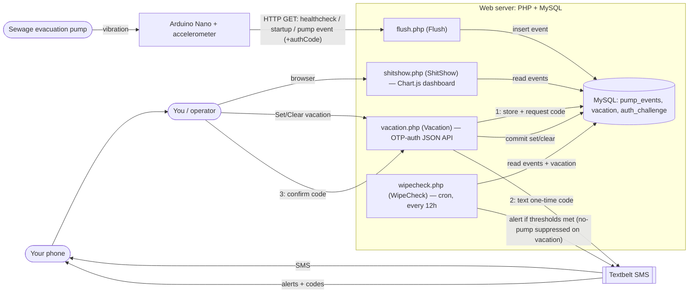

# Pump Backend
So you've got yourself an Arduino board to monitor your evacuation pump and loaded the [pump monitor](https://github.com/thejart/pump-monitor) code on it? Congrats, that's half the equation! Now you need some backend code to monitor the monitor.

## Architecture
The Arduino (with an accelerometer) watches the basement evacuation pump and fires authenticated HTTP requests to `flush.php`, which timestamps each event into MySQL. A cron'd `wipecheck.php` watches for trouble (too few healthchecks, no recent pumping, MySQL down) and texts you via Textbelt. You view history on the `shitshow.php` Chart.js dashboard, and can declare a "vacation" (which suppresses the no-pumping alert) via `vacation.php`, authenticated by a one-time code texted to your phone.

The diagram source lives at [`docs/architecture.mmd`](docs/architecture.mmd) (edit it on [mermaid.live](https://mermaid.live)).



## Scripts Overview
- `flush.php` This is the endpoint that the pump monitor's HTTP request will hit. It's responsible for parsing out the query params, determining the type of request (startup, pumping or healthcheck) and inserting a row into a database table.
- `shitshow.php` This is an endpoint used to display recent requests in a graph format (see below for more info).
- `wipecheck.php` This is an optional script that should be cron'd. It will monitor recent usage and send a text message via [Textbelt](https://textbelt.com/) if any thresholds have been met.
- `vacation.php` This endpoint lets you set a "vacation end date" that suppresses the *no recent pumping* alert until that date passes (handy when nobody's home to fill the basin). The healthcheck and database-down alerts stay active so you still learn if the monitor itself dies while you're away. See below for usage.

## Getting Started
1. Get the [pump monitor](https://github.com/thejart/pump-monitor) setup
2. Setup a webserver with a relational database
3. Create a table for storing pump events (see below)
4. Clone this repo in a web directory
5. Create an .env file and lock it down (see below)

---
### Table Schema
```
CREATE TABLE `pump_events` (
  `id` bigint(20) NOT NULL AUTO_INCREMENT,
  `x_value` double(4,2) NOT NULL,
  `y_value` double(4,2) NOT NULL,
  `z_value` double(4,2) NOT NULL,
  `type` int(11) NOT NULL,
  `timestamp` datetime NOT NULL,
  PRIMARY KEY (`id`),
  UNIQUE KEY `timestamp` (`timestamp`)
) ENGINE=InnoDB DEFAULT CHARSET=utf8mb4
```

You also need a `vacation` table for the vacation-override feature (see `vacation.php` below):
```
CREATE TABLE `vacation` (
  `id` bigint(20) NOT NULL AUTO_INCREMENT,
  `end_date` datetime NOT NULL,
  `is_archived` tinyint(1) NOT NULL DEFAULT 0,
  `created_at` datetime NOT NULL DEFAULT CURRENT_TIMESTAMP,
  PRIMARY KEY (`id`)
) ENGINE=InnoDB DEFAULT CHARSET=utf8mb4
```
`end_date` is compared against the database server's `NOW()` (server-local time). Setting a new date archives any currently-active one (`is_archived`) rather than deleting it, so the table keeps a history of past vacations.

Setting/clearing a vacation is authenticated by a one-time code texted to you (see `vacation.php`), which needs an `auth_challenge` table:
```
CREATE TABLE `auth_challenge` (
  `id` bigint(20) NOT NULL AUTO_INCREMENT,
  `code_hash` char(64) NOT NULL,
  `action` varchar(16) NOT NULL,
  `payload` varchar(64) DEFAULT NULL,
  `attempts` int(11) NOT NULL DEFAULT 0,
  `expires_at` datetime NOT NULL,
  `created_at` datetime NOT NULL DEFAULT CURRENT_TIMESTAMP,
  PRIMARY KEY (`id`)
) ENGINE=InnoDB DEFAULT CHARSET=utf8mb4
```

### .env file
The .env file contains all the personal data that needs to be kept out of source control. Make sure that it's readable by your webserver's user, but otherwise locked down (eg. `chown <youruser>:<webuser> .env && chmod 640 .env`).

**IMPORTANT:** Make sure this file isn't leaked to the world by your webserver!
```
<mysql database>
<mysql username>
<mysql password>
<pump/health call auth code>
<textbelt auth token>
<SMS (comma delimited) recipient numbers>
```

### vacation.php
A JSON endpoint that dispatches on an `action` param. Reading is public; mutating is authenticated by a one-time code texted (via Textbelt) to the `.env` recipient number(s) — so you never type a shared secret into the browser. Possession of the phone *is* the credential.

- `action=read` (default) Returns current status: `{"ok":true,"active":bool,"end_date":string|null}`.
- `action=request` Starts a change. Pass `op=set` with an `endDate` (`YYYY-MM-DD` is fine — set it to the day you *return*), or `op=clear`. Generates a 6-digit code, stores it (hashed) bound to that pending change, and texts it to you.
- `action=confirm` Pass the texted `code`. On success the bound set/clear is committed and the code is consumed.

The code is single-use, expires after 10 minutes (`AUTH_CHALLENGE_TTL_SECONDS`), and locks out after 5 wrong guesses (`AUTH_CHALLENGE_MAX_ATTEMPTS`). Issuing a new code is rate-limited (`Vacation::REQUEST_RATELIMIT_SECONDS`) so the public dashboard can't spam your phone / run up Textbelt cost.

```
curl 'https://your-host/vacation.php'
# request a code, then confirm it:
curl -d 'action=request&op=set&endDate=2026-07-15' 'https://your-host/vacation.php'
curl -d 'action=confirm&code=123456' 'https://your-host/vacation.php'
```

**Note:** because the code is sent over the same Textbelt key/quota as your pump alerts, a paid key is recommended so confirmation texts don't compete with (or get starved by) a real alert.

The `shitshow.php` dashboard shows current vacation status and drives this flow: picking a date and hitting **Set** (or **Clear**) requests a code, then a modal collects the texted code and confirms.

### shitshow.php / Chart.js
The shitshow.php endpoint uses Chart.js to display recent events and accomodates a few optional GET parameters:
- `days` (Default: 7) Changes the number of days rendered in the chart
- `deduced` (Default: true) Toggles whether washing machine events are interpretted from the given pump events and displays them as a separate dataset. **Note:** This is admitedly *very* specific to my setup and should probably be 1) configurable and 2) not on by default, but hey, I'm the only one using this at the moment.


